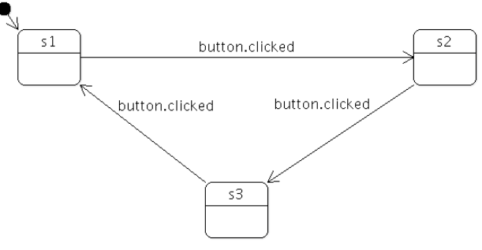
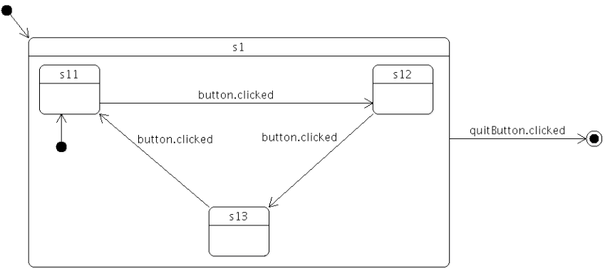
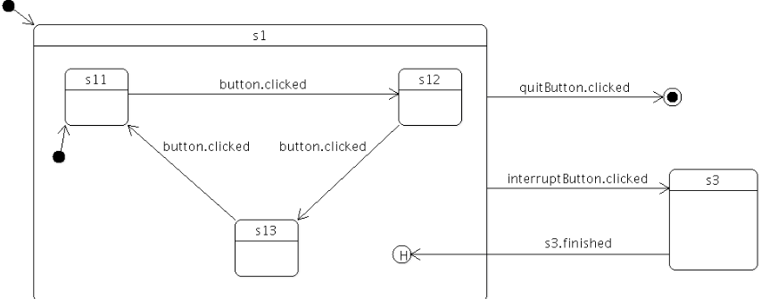
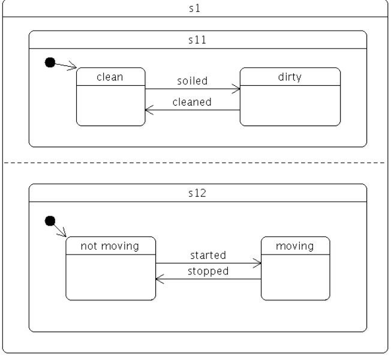
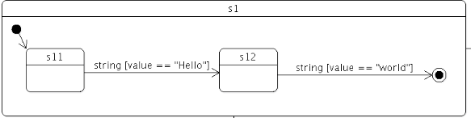

- [QT状态机](#qt状态机)
  - [相关类](#相关类)
    - [状态机核心：QStateMachine](#状态机核心qstatemachine)
    - [基础状态：QState](#基础状态qstate)
    - [状态抽象基类：QAbstractState](#状态抽象基类qabstractstate)
    - [最终状态：QFinalState](#最终状态qfinalstate)
  - [例子](#例子)
    - [1 简单状态机](#1-简单状态机)
    - [2 组状态](#2-组状态)
    - [3 历史回溯状态](#3-历史回溯状态)
  - [4 并行状态](#4-并行状态)
  - [5 无状态转换](#5-无状态转换)
  - [6 事件状态转换](#6-事件状态转换)


# QT状态机

QT 提供了一套完整的有限状态机框架，主要用于复杂的状态切换逻辑，比如协议解析，UI状态切换等等，避免了大量 `if-else`语句导致整体代码非常复杂且臃肿。

## 相关类
### 状态机核心：QStateMachine

作用：
* 作为有限状态机的 "容器" 和 "驱动引擎"，管理所有状态和状态转换，负责触发状态的进入 / 退出动作。
* 核心能力：启动 / 停止状态机、管理全局状态、处理事件队列、支持异步状态切换。
* 常用方法：start()（启动状态机）、stop()（停止状态机）、addState()（添加状态）、setInitialState()（设置初始状态）。
  
### 基础状态：QState
作用：
* 表示有限状态机中的普通状态，是最常用的状态类，可直接实例化或继承扩展自定义状态。
* 核心能力：
    * 绑定 "进入动作"（进入该状态时执行）和 "退出动作"（离开该状态时执行）。
    * 定义到其他状态的转换规则（如信号触发、事件触发）。
    * 支持嵌套（作为父状态，包含子状态，实现状态分组）。
* 核心信号：entered()（状态被进入时触发）、exited()（状态被退出时触发）。
* 常用方法：addTransition()（添加状态转换规则）、assignProperty()（进入状态时自动设置目标对象的属性，简化 UI 状态更新）。
  
### 状态抽象基类：QAbstractState
作用：
* 所有状态类的抽象基类，QState、QFinalState均继承自它。
* 意义：提供统一的状态接口，便于扩展自定义状态（如重写onEntry()、onExit()实现复杂状态逻辑）。

### 最终状态：QFinalState
作用：
* 表示有限状态机的终止状态（结束状态），当状态机切换到该状态时，意味着整个状态流程完成。
* 核心特性：无退出动作，也无法定义到其他状态的转换，是状态流程的 "终点"。
* 触发事件：当状态机进入QFinalState时，会发出finished()信号，可用于监听状态流程结束。


## 例子

### 1 简单状态机

```C++
QStateMachine machine;
QState *s1 = new QState();
QState *s2 = new QState();
QState *s3 = new QState();

s1->addTransition(button, &QPushButton::clicked, s2);
s2->addTransition(button, &QPushButton::clicked, s3);
s3->addTransition(button, &QPushButton::clicked, s1);

s1->assignProperty(label, "text", "In state s1");
s2->assignProperty(label, "text", "In state s2");
s3->assignProperty(label, "text", "In state s3");

QObject::connect(s3, &QState::entered, button, &QPushButton::showMaximized);
QObject::connect(s3, &QState::exited, button, &QPushButton::showMinimized);

machine.addState(s1);
machine.addState(s2);
machine.addState(s3);
machine.setInitialState(s1);
machine.start();
```

* 创建了一个状态机，包含了3个状态
* 通过按键点击触发状态转换，`addTransition`是添加转换动作
* 通过`assignProperty`，可以在触发转换动作时，修改属性，这个非常有用
* 而每次状态进入/退出时都会触发一次信号，我们可以利用这2个信号做相应动作

**默认情况下，状态机是无线循环的，当我们想结束状态机时，怎么做呢？**

### 2 组状态



```C++

QState *s1 = new QState();
QState *s11 = new QState(s1);
QState *s12 = new QState(s1);
QState *s13 = new QState(s1);

s1->setInitialState(s11);
machine.addState(s1);

QFinalState *s2 = new QFinalState();
s1->addTransition(quitButton, &QPushButton::clicked, s2);

machine.addState(s2);
machine.setInitialState(s1);

QObject::connect(&machine, &QStateMachine::finished,
                QCoreApplication::instance(), &QCoreApplication::quit);
```

* 可以看到s11 s12 s13的父组件是s1，在QT状态机中这样的关系被称为组状态`Group State`
* 我们添加一个新的状态`QFinalState`添加在状态机中，这样如果触发了该状态，
状态机就会退出

> 需要留意，状态转换可以转换到任意模板，不需要考虑其层级关系的

### 3 历史回溯状态

想象一下：假如我们在处理UI窗口状态，突然会被打断显示其他信息，显示完后恢复状态，怎么做？

QT提供了`QHistoryState`用于恢复状态机状态




```C++
m_btn = new QPushButton("11", this);
m_btn->setGeometry(50, 50, 50, 50);
m_btn->show();

QPushButton* interruptBtn = new QPushButton("iterrupt", this);
interruptBtn->setGeometry(120, 50, 50, 50);
interruptBtn->show();

QPushButton* recoveryBtn = new QPushButton("recovery", this);
recoveryBtn->setGeometry(170, 50, 50, 50);
recoveryBtn->show();

QState *s11 = new QState(&s1);
QState *s12 = new QState(&s1);
QState *s13 = new QState(&s1);
s1.setInitialState(s11);

machine.addState(&s1);
machine.addState(&s2);

machine.setInitialState(&s1);

QObject::connect(&machine, &QStateMachine::finished,
                    QCoreApplication::instance(), &QCoreApplication::quit);

QHistoryState* s2h = new QHistoryState(&s1);
s1.addTransition(interruptBtn, &QPushButton::clicked, &s2);
s2.assignProperty(m_btn, "text", "s2");

s2.addTransition(recoveryBtn, &QPushButton::clicked, s2h);

s11->addTransition(m_btn, &QPushButton::clicked, s12);
s12->addTransition(m_btn, &QPushButton::clicked, s13);
s13->addTransition(m_btn, &QPushButton::clicked, s11);

s11->assignProperty(m_btn, "text", "11");
s12->assignProperty(m_btn, "text", "12");
s13->assignProperty(m_btn, "text", "13");

QMessageBox *mbox = new QMessageBox(this);
mbox->addButton(QMessageBox::Ok);
mbox->setText("Interrupted!");
mbox->setIcon(QMessageBox::Information);
QObject::connect(&s2, &QState::entered, mbox, &QMessageBox::exec);
```

* 我们创建了s11 s12 s13一个组归属于s1状态，s2为中断状态，通过2个按键进入中断和恢复状态
* 在状态运转过程中，s2h会记录 s1内部的状态，当进行恢复时会恢复s2h记录到的状态
* 注意：**QHistoryState 在创建时指定的父状态就是其需要去记录的状态组**

## 4 并行状态

想象一下这样的场景，在智能化屋子里，你需要同时控制灯光开/关，空调开/关，温度数据采集这些任务，这时候，你就会管理很多种状态，且状态就会有非常多种组合逻辑，而在前面介绍的状态机明显不符合当前需求，怎么办？


* 可以将`QState`设置成`ParallelStates`模式，这样其所有子状态都会并行被激活，互补干扰，从而把各个任务的状态给解耦。
* 并行复合状态的子状态可以是普通顺序复合状态，也可以是另一个并行复合状态，形成「并行 + 顺序」的嵌套结构，满足复杂业务场景。

> 注意所有并行操作都是原子操作，所以外部事件到了不会打断当前并行操作，但是状态机本质上是单线程的，所以事件的处理会在后续被执行。




```C++
  QPushButton* cleanDdirtyBtn = new QPushButton("c", this);
  cleanDdirtyBtn->setGeometry(120, 50, 50, 50);
  cleanDdirtyBtn->show();

  QPushButton* movNotMovBtn = new QPushButton("m", this);
  movNotMovBtn->setGeometry(120, 150, 50, 50);
  movNotMovBtn->show();

  QState* s1 = new QState(QState::ParallelStates);
  s1->setObjectName("s1");

  QState* cState = new QState(s1);
  QState* cclean = new QState(cState);
  QState* dirty = new QState(cState);

  cState->setInitialState(cclean);

  cclean->setObjectName("clean");
  dirty->setObjectName("dirty");

  cclean->addTransition(cleanDdirtyBtn, &QPushButton::clicked, dirty);
  dirty->addTransition(cleanDdirtyBtn, &QPushButton::clicked, cclean);

  QState* mState = new QState( s1);
  QState* mov = new QState(mState);
  QState* notmov = new QState(mState);
  mState->setInitialState(mov);

  mov->setObjectName("move");
  notmov->setObjectName("not move");

  mov->addTransition(movNotMovBtn, &QPushButton::clicked, notmov);
  notmov->addTransition(movNotMovBtn, &QPushButton::clicked, notmov);

  auto connectStateDebug = [](QState *state) {
      QObject::connect(state, &QState::entered, [state]() {
          qDebug() << "进入状态：" << state->objectName();
      });
      QObject::connect(state, &QState::exited, [state]() {
          qDebug() << "== 退出状态：" << state->objectName();
      });
  };

  connectStateDebug(cclean);
  connectStateDebug(dirty);
  connectStateDebug(mov);
  connectStateDebug(notmov);

  machine.addState(s1);
  machine.setInitialState(s1);
```

* s1 设置为`ParallelStates`状态，子状态设置为默认状态，这样保证了任务内部的状态是串行，任务之间是并行的
* 2个按键分别代表2个任务状态切换动作，
  * **当并行任务开始进入的时候，2个子任务都会并行进入**
  * **并且子任务各自内部的转换都是独立**
  * **如果有一个子任务进入退出状态，那么所有任务以及父状态都会退出**

**在整个状态机框架都遵循并行语义的，所有并行操作都是独立，并且是过程都是原子性的。当然，这是宏观，看上去是并行的，实际上，所有处理流程都是串行的，因为整个状态机系统就是一个单线程**


## 5 无状态转换

在状态机框架中，转换的触发是不需要有一个明确的目标状态的，跟有目标状态不同地方在于，无状态转换不会触发任何状态变更。  
无状态转换比较适用一下场景：
* 需要通过触发状态处理业务，但是不能进行状态转换

```C++
    QPushButton* cleanDdirtyBtn = new QPushButton("c", this);
    cleanDdirtyBtn->setGeometry(120, 50, 50, 50);
    cleanDdirtyBtn->show();

    QPushButton* movNotMovBtn = new QPushButton("m", this);
    movNotMovBtn->setGeometry(120, 150, 50, 50);
    movNotMovBtn->show();

    QPushButton* midBtn = new QPushButton("mid", this);
    midBtn->setGeometry(180, 150, 50, 50);
    midBtn->show();

    QState* root = new QState();
    root->setObjectName("root");
    QState* child1 = new QState();
    child1->setObjectName("child1");
    QState* mid = new QState();
    mid->setObjectName("mid");

    QSignalTransition* st = new QSignalTransition(midBtn, &QPushButton::clicked, root);

    connect(st, &QAbstractTransition::triggered, [&](){
        qDebug()<<"targetless transition trigger !!!!";
    });

    mid->addTransition(st);
    root->addTransition(cleanDdirtyBtn, &QPushButton::clicked, mid);
    child1->addTransition(movNotMovBtn, &QPushButton::clicked, root);

    auto connectStateDebug = [](QState *state) {
        QObject::connect(state, &QState::entered, [state]() {
            qDebug() << "进入状态：" << state->objectName();
        });
        QObject::connect(state, &QState::exited, [state]() {
            qDebug() << "== 退出状态：" << state->objectName();
        });
    };

    connectStateDebug(root);
    connectStateDebug(mid);
    connectStateDebug(child1);

    machine.addState(root);
    machine.addState(mid);
    machine.addState(child1);

    machine.setInitialState(root);
```

* 上面代码有3种状态：root, mid, child
* mid是无目标状态
* 只有当前状态是mid时，无状态装欢特性才会生效

## 6 事件状态转换

QT的事件状态转换使用独立的事件循环，而前面的讲的信号转换，实际上就是拦截了对应的信号，并发送`QStateMachine::SignalEvent`。而如果是`QObject` event，就使用 `QStateMachine::WrappedEvent`  

如果说想发送自定义事件：
* 需要编写自定义事件类
* 那么可以使用`QStateMachine::postEvent()`  

而如何接收这些自定义事件呢？
* 需要继承 `QAbstractTransition`
* 重载`QAbstractTransition::eventTest()`，在该函数内进行事件判断

```C++
class StringEvent : public QEvent
{
public:
    StringEvent(QString s) : QEvent(QEvent::Type(User + 1)), m_str(s){}

    QString m_str;
};

class StringTranstion : public QAbstractTransition
{
    Q_OBJECT
public:
    StringTranstion(QString s) : m_str(s){}

protected:
    bool eventTest(QEvent* event) override
    {
        if(event && (event->type() == QEvent::User+1))
        {
            StringEvent* e = static_cast<StringEvent*>(event);

            return e->m_str == m_str;
        }

        return false;
    }
    void onTransition(QEvent* event) override{}
private:
    QString m_str;
};

void StateMachineTest::eventTransition()
{
    QPushButton* rootBtn = new QPushButton("c", this);
    rootBtn->setGeometry(120, 50, 50, 50);
    rootBtn->show();

    QPushButton* childBtn = new QPushButton("m", this);
    childBtn->setGeometry(120, 150, 50, 50);
    childBtn->show();

    QState* root = new QState();
    root->setObjectName("root");
    QState* child1 = new QState();
    child1->setObjectName("child");

    StringTranstion* hello = new StringTranstion("hello");
    hello->setTargetState(child1);

    StringTranstion* world = new StringTranstion("world");
    world->setTargetState(root);

    root->addTransition(hello);
    child1->addTransition(world);

    connect(rootBtn, &QPushButton::clicked, [&](){
        machine.postEvent(new StringEvent("hello"));
    });

    connect(childBtn, &QPushButton::clicked, [&](){
        machine.postEvent(new StringEvent("world"));
    });

    auto connectStateDebug = [](QState *state) {
        QObject::connect(state, &QState::entered, [state]() {
            qDebug() << "进入状态：" << state->objectName();
        });
        QObject::connect(state, &QState::exited, [state]() {
            qDebug() << "== 退出状态：" << state->objectName();
        });
    };

    connectStateDebug(root);
    connectStateDebug(child1);

    machine.addState(root);
    machine.addState(child1);

    machine.setInitialState(root);
}


```


* 上面创建了一个自定义字符串事件以及一个字符串转换类
* 当按键按下会发送一个`StringEvent`, 该事件会进入到`StringTranstion::eventTest()`中，如果函数返回 true，说明事件捕捉成功，触发状态转换


